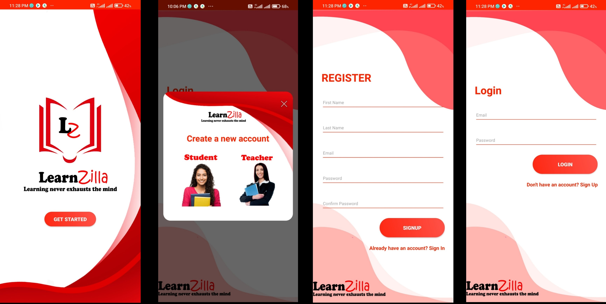

<h1 align="center">LEARNZILLA</h1>

The Learning Management System that provides the framework to handles all aspects of the learning process..

  

## Built With

- JavaScript
- Java
- HTML
- CSS

## Authors

**Abdullah Ramees**

- [Profile](https://github.com/AbdullahRamees "Abdullah Ramees")
- [Email](mailto:abdullahramees147@gmail.com?subject=Hi "Hi!")

**Isuruni Rathnayake**

- [Profile](https://github.com/Isuruni "Isuruni Rathnayake")
- [Email](mailto:isuruni.rathnayaka0508@gmail.com?subject=Hi "Hi!")

**Mahela Dissanayake**

- [Profile](https://github.com/maheladissa "Mahela Dissanayake")
- [Email](mailto:maheladissanayake@gmail.com?subject=Hi "Hi!")

**Nipuni Perera**

- [Profile](https://github.com/nipuninawodani "Nipuni Perera")
- [Email](mailto:nipuninawodani999@gmail.com?subject=Hi "Hi!")

**Sachin Tharaka**

- [Profile](https://github.com/Sachin-Tharaka "Sachin Tharaka")
- [Email](mailto:tharakasachin98@gmail.com?subject=Hi "Hi!")

**Waruni Lalendra**

- [Profile](https://github.com/WaruniLalendra "Waruni Lalendra")
- [Email](mailto:warunilalendra@gmail.com?subject=Hi "Hi!")

## 🤝 Support

Contributions, issues, and feature requests are welcome!

Give a ⭐️ if you like this project!
